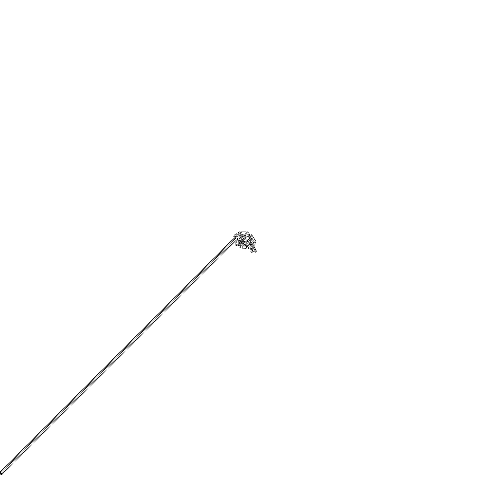

# The ant on the board (variant of the Langton's Ant)

## The Task

There is a board of 1024 x 1024 white cells.
The ant located on the board in position (512, 512) and looks to the up.

The ant follows this rules:

- when it step onto a **white** cell
  then turns **clockwise**,
  then it inverts the color of the cell,
  then moves forward the the next cell;
- when in step onto a **black** cell
  then turns **counterclockwise**,
  then it inverts the color of the cell,
  then moves forward to the next cell.

The game ends when the Ant reaches end of the Board.

What program should do:

- resolve the ant's path;
- draw the path as BMP or PNG image with color depth 1, assuming that one cell is one pixel;
- calculate number of black cells on it;
- use at less RAM as possible.

## The solution

The cell data packed into array of u8. One cell represents by one bit. See [src/game.rs](src/game.rs) for details.

Coordinages range of the board is `(1, 1) .. (1024, 1024)`. The `(1, 1)` cell is on top left corner.

## How to run

```bash
$ cargo run
   Compiling ant v0.1.0 (...)
    Finished dev [unoptimized + debuginfo] target(s) in 0.48s
     Running `target/debug/ant`
The game finished in 35680 iterations with 3679 black cells.
See out/image.png for the path image.
```

Image sample:



## Memory usage details

```bash
$ /usr/bin/time target/release/ant
0.00user 0.00system 0:00.00elapsed 100%CPU (0avgtext+0avgdata 3032maxresident)k
0inputs+16outputs (0major+173minor)pagefaults 0swaps
```

The board structure placed in the heap and takes `std::mem::size_of::<[u8; 131072]>()` = 131072 bytes (128k).
